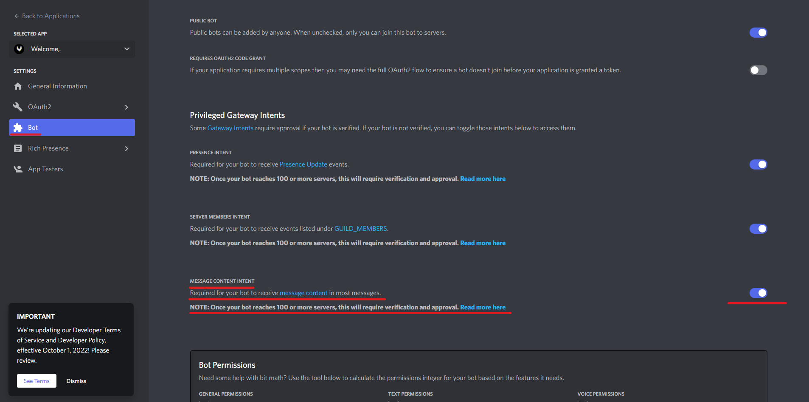

# Discord bot of the Open Study Room
### Huge thanks to FluffM for coding it. Original code can be found [here](https://github.com/Thrillberg/looking-for-game-bot).

This bot has a variety of commands, and it is still in active development.
The most basic commands to get our users going are listed below:

```
!roles - Gives you information about the available roles in our OSR Discord Channel

!league - Contains information about OSR Leagues, rules and participation

!sensei [term] - Displays the first paragraph for a specified term from Sensei's Library

!quote [id] [response] -  Quotes a message using a specific message ID and responds to the message author.

!info - Basic info about the bot.

!help - A more detailed list of commands.
```

To run it, you'll need to provide your own bot token. You can get one from the [Discord Developer Portal](https://discordapp.com/developers/applications/).
Once you have your token, put in at the end of sample.env, right after `TOKEN=`, and rename it to .env.


Local setup: Install dependencies using `pip install -r requirements.py`.
Expects python3.6+. Set up a testing server and insert appropriate guild id and
channel ids in config.py. You can skip KGS integration by removing the check
task from the end of bot.py.

### Warning:
Be sure Message Intents are enabled in your bot's settings.

Here is how to enable them:
1. Go to the [Discord Developer Portal](https://discord.com/developers/applications)
2. Click on your bot
3. Go to the "Bot" tab
4. Scroll down to "Privileged Gateway Intents"
5. Enable both "Message Intents"
6. Save changes
7. Done :) !
